<h1 style="color:#1a49b5"><center>Exploration approfondie des bases de données NoSQL : Une plongée dans le monde de MongoDB et Redis</center></h1>
<hr>

<h2>Table des matières:</h2>
<h4>Introduction</h4>
<h4>I. la Dénormalisation</h4>
1. Étude de cas<br>
2. La tranformation des fichiers<br>
3. La jointure sur des objets JSON<br>
<h4>II. Découverte de la base de donnée Redis</h4>
1. Installation de Redis<br>
2. Connecter à Redis avec Python<br>
3. Les commandes fondammentales<br>
4. Bloom Filter<br>
5. Étude des performances de Redis<br>
6. Publication et souscription<br>
<h4>III. Découverte de la base de donnée MongoDB</h4>
1. Installation de MongoDB<br>
2. Commandes fondamentales de MongoDB<br>
3. Les commandes fondammentales<br>
4. La jointure des Objets JSON avec MongoDB<br>
5. Étude des performances de MongoDB<br>
6. Publication et souscription<br>

<h4>Conclusion</h4>
<hr>

<h3>Introduction:</h3>

<p style="text-align: justify">
Les systèmes de gestion de base de données traditionnels ont longtemps dominé le paysage informatique, mais avec l'évolution rapide des applications modernes, de nouvelles approches sont nécessaires pour répondre aux exigences de performances et de flexibilité croissantes. Parmi ces approches novatrices, les bases de données NoSQL émergent comme des solutions puissantes, dépassant les limites des modèles relationnels classiques. Dans ce contexte, notre compte rendu se penchera sur deux acteurs majeurs du monde NoSQL : MongoDB et Redis.
</p>
<p style="text-align: justify">
Notre exploration approfondie des bases de données NoSQL, avec une attention particulière portée sur MongoDB et Redis, se centrera sur un élément clé de leur architecture : la dénormalisation des tables. Avant d'approfondir ce concept essentiel, nous examinerons de près les raisons et les critères sous-tendant la dénormalisation. Cette démarche préliminaire jettera les bases nécessaires pour une compréhension approfondie des avantages et des implications de cette approche dans le contexte de MongoDB et Redis.

La prochaine étape nous conduira à explorer en détail les commandes de base de Redis, mettant en exergue une méthode tout particulièrement fascinante : le filtre de Bloom. Cette approche s'avère être une méthode efficace pour optimiser les opérations de stockage et de recherche, ajoutant une dimension intrigante à notre exploration de cette base de données en mémoire.

La route de notre exploration se poursuivra avec une évaluation minutieuse de la performance de Redis, mettant l'accent sur son comportement face à des ensembles de données dépassant les 100 000 éléments. Cette analyse approfondie jettera une lumière précise sur la capacité de Redis à évoluer de manière agile et performante dans des contextes de traitement de données massives.

Nous plongerons ensuite dans l'univers riche de MongoDB, explorant ses commandes fondamentales et scrutant sa performance dans divers contextes d'utilisation. Cette incursion dans la base de données orientée document nous permettra de saisir les nuances de son approche flexible axée sur la gestion de données non structurées.

Enfin, notre étude atteindra son apogée avec une comparaison de la performance entre Redis et MongoDB. Cette analyse comparative soulignera les avantages et les spécificités de chaque solution, offrant une vision éclairée pour ceux qui recherchent des solutions NoSQL adaptées à leurs besoins spécifiques. Préparez-vous à découvrir comment MongoDB et Redis, en combinant souplesse et performance, tracent la voie vers l'avenir de la gestion des informations, répondant ainsi aux défis complexes posés par les applications modernes.
</p>
<hr>

<h2>I. La dénormalisation:</h2>
<p style="text-align: justify"> 
La dénormalisation est une technique de conception de bases de données qui consiste à regrouper des tables relationnelles initialement normalisées pour former une structure plus plate et moins normalisée. Cette approche vise à améliorer les performances en réduisant le nombre de jointures nécessaires lors des requetes. Contrairement à la normalisation, qui cherche à organiser les données pour minimiser la redondance.
</p>

<h3>1. Étude de cas:</h3>
<p style="text-align: justify">
Afin de mieux comprendre les avantages de la dénormalisation, considérons le modèle relationnel pour une compagnie aérienne présenté dans <B>la figure 1</B>, Cette démarche nous permettre de saisir les raisons sous-jacentes à l'utilisation de la dénormalisation et de comprendre son lien avec les bases de données NoSQL.
</p>
<p style="text-align: justify">
Imaginons une situation ou la compagnie aérienne souhaite améliorer la performance lors de l'affichage des détails d'un vol, y compris les information sur l'avion, le pilote et la reservation associées. Dans ce modèle normalisé, cela impliquerait des opération de jointure complexes.
</p>

<center>
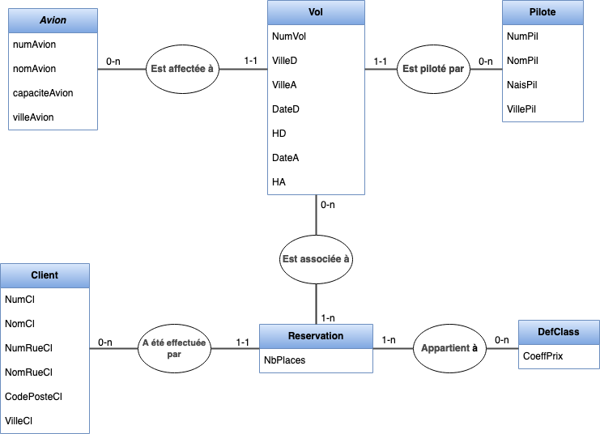
<h5><b>Figure 1: Modèle de données normalisé pour une companie aérienne<b></h5>
</center>


<h3 style="text-align: justify">
Comment pouvons-nous dénormaliser notre Base de données ?
</h3>
<p >
Voici quelques pistes à appliquer pour dénormaliser notre base de données :
</p>

<p style="text-align: justify">
    
***1.Des données fréquemment interrogées conjointement:*** <br>
Dans le cas de nos tables, si nous effectuons fréquemment des requêtes qui nécessitent des informations sur les vols, les réservations et les classes de manière conjointe, vous pourriez envisager de dénormaliser en regroupant ces données dans une seule table, par exemple une table "InfoVols". Ainsi, au lieu de faire des jointures, vous auriez toutes les informations nécessaires dans une seule table.
</p>
<p style="text-align: justify">
    
***2.Toutes les données d’une entité sont indépendantes:*** <br>
Si les données des vols, des avions, des pilotes, des clients, des définitions de classes et des réservations sont relativement indépendantes les unes des autres, nous pourrions envisager une dénormalisation en regroupant ces données dans une table "InfoVols", évitant ainsi des jointures fréquentes.</p>
<p style="text-align: justify">
    
***3.Une association avec des relations 1-n des deux côtés:*** <br>
Si vous avez des associations avec des relations 1-n des deux côtés, par exemple entre les vols et les réservations, vous pourriez envisager une dénormalisation en intégrant les réservations directement dans la table "InfoVols", représentée par : “[{NumCl, Classe, NbPlaces}]”.
</p>
<p style="text-align: justify;">
    
***4.Même taux de mises à jour:*** <br>
Si les taux de mise à jour des différentes entités (vols, avions, pilotes, clients, etc.) sont équivalents, vous pourriez envisager une dénormalisation plus poussée en regroupant toutes les données dans une table "InfoVols" présenté dans <b>la figure 2</b>, simplifiant ainsi la gestion des mises à jour.
</p>


<center>
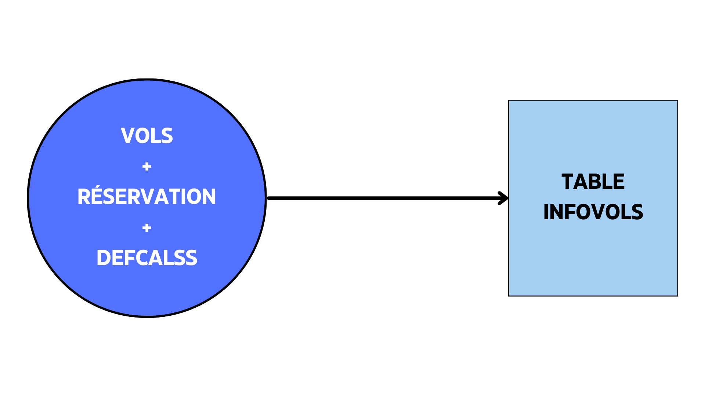
<h5><b>Figure 2: Représentation de la table  dénormalisée<b></h5>
</center>

<h3>Résultat:</h3>
<p style="text-align: justify">
L'implémentation concrète notre dénormalisation est exposée dans <b>la figure 3</b>, sous forme de représentation JSON. Cela suggère que la dénormalisation a été réalisée en regroupant les informations nécessaires dans une seule structure de données, éliminant ainsi la nécessité de faire des jointures lors de la récupération des détails d'un vol.
</p>
<center>
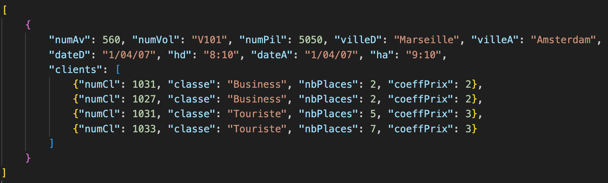
<h5><b>Figure 3: Représentation JSON de la dénormalisation<b></h5>
</center>

<p style="text-align: justify">
La dénormalisation s'inscrit parfaitement dans l'environnement NoSQL. Ce modèle denormalisé offre la flexibilité necessaire pour stocker des données de manière à optimiser les requetes sans etre limité par une structure de schéma rigide.
</p>
<p style="text-align: justify">
Une fois la dénormalisation réalisée, une perspective future serait la migration de la base de données relationnelle vers une base de données NoSQL. Ce choix dépendra du type spécifique de NoSQL envisagé, car il existe divers modèles tels que la base de donnée orientée document(comme MongoDB), clé-valeur(comme Redis),comme nous le discuterans plus en détails ultérieurement. Chacun de ces modèle NoSQL offre des avantages en fonction des besoins.
</p>

<h3>2. La tranformation des fichiers:</h3>
<h4>2.1. Transformation des fichiers txt aux fichiers csv:</h4>
<p style="text-align: justify">
Dans cette partie, nous aborderons le processus de transformation d'un fichier au format TXT contenant des données sur les avions vers un format CSV, en vue de l'intégrer dans la base de données. Pour ce faire, nous utilisons le langage de programmation Python et la bibliothèque pandas. 
<p style="text-align: justify">
Le code commence par lire le fichier "Avions.txt" avec la fonction "read_csv" de pandas, en spécifiant que les données sont séparées par des tabulations. Ensuite, des libellés de colonnes appropriés sont définis dans une liste appelée "headers", ces libellés sont appliqués au DataFrame résultant.
</p>
<p style="text-align: justify">
Le DataFrame modifié est ensuite sauvegardé dans un fichier CSV "AVIONS.csv" dans le répertoire "csv", en utilisant la fonction "to_csv" de pandas. Le paramètre "index=None" indique de ne pas inclure les indices de lignes dans le fichier CSV résultant.
</p>
<p>
Ce processus de la transformation cruciale pour préparer les données afin de les intégrer efficacement dans la base données.
</p>

***Fichier_text:***


```python
with open("txt/AVIONS.txt", 'r') as file_avion:
    lignes = file_avion.readlines()
    for index, ligne in enumerate(lignes):
        print(ligne)
        if index==2:
            break
        
```

    720	 Boeing 727	150	Marseille
    
    250	Boeing 747	500	Paris
    
    269	Boeing 737	300	Paris
    


***Méthode_de_transformation:***


```python
import pandas as pd

file_avion = pd.read_csv ('txt/AVIONS.txt', sep='\t')
headers =  ["NumAv", "NomAv", "CapAv", "VilleAv"]
file_avion.columns = headers
file_avion.to_csv ('csv/AVIONS.csv', index=None)
```

***Résultat:***


```python
df = pd.read_csv("csv/AVIONS.csv")
df.head(3)
```


<div>
<style scoped>
    .dataframe tbody tr th:only-of-type {
        vertical-align: middle;
    }

    .dataframe tbody tr th {
        vertical-align: top;
    }

    .dataframe thead th {
        text-align: right;
    }
</style>
<table border="1" class="dataframe">
  <thead>
    <tr style="text-align: right;">
      <th></th>
      <th>NumAv</th>
      <th>NomAv</th>
      <th>CapAv</th>
      <th>VilleAv</th>
    </tr>
  </thead>
  <tbody>
    <tr>
      <th>0</th>
      <td>250</td>
      <td>Boeing 747</td>
      <td>500</td>
      <td>Paris</td>
    </tr>
    <tr>
      <th>1</th>
      <td>269</td>
      <td>Boeing 737</td>
      <td>300</td>
      <td>Paris</td>
    </tr>
    <tr>
      <th>2</th>
      <td>240</td>
      <td>Boeing 737</td>
      <td>300</td>
      <td>Paris</td>
    </tr>
  </tbody>
</table>
</div>


  <h4>2.2. Transformation des fichiers CSV aux fichiers JSON:</h4>

<p style="text-align: justify">Dans la phase de préparation de notre système pour l'utilisation de bases de données NoSQL(MongoDB et Redis), une étape importante consiste à convertir notre jeu de données, initialement stocké au format CSV, vers un format JSON.
</p>
<p style="text-align: justify">
Cette opération est réalisée en utilisant la bibilothéque <b>pandans</b> en Python. La transformation s'effectue de manière simple et efficace grace à la méthode "to_json" de pandas:
</p>

***Méthode_de_transformation:***


```python
df.to_json("json/Avions.json", orient='records')
#Affichage JSON
#df = pd.read_json("json/koko.json")
#df.to_string()
```

<p style="text-align: justify">
Dans cette commande "df" représente le DataFrame pandas qui contenait les données extraites du fichier CSV. L'argument "json/avions.json" spécifie le chemain et le nom du fichier JSON résultant dans lequel les données converties seront enregistrées. L'rgument orient='records' spécifie que chaque enregistrement du DataFrame est représenté comme un objet JSON distinct dans le fichier résultant.
</p>
<p style="text-align: justify">
Cette conversion prépare nos données pour etre facilement ingérées pas les bases de données NonSql. Le format JSON offre une représentation adaptée a ces bases de données, facilitant ainsi l'insertion, la mise à jour et la requete de données coplexes.
</p>
<p style="text-align: justify">
En procédant de la sorte, notre système est pret à exploiter aux mieux les fonctionnalités de stockage et de récupération de nos bases de données(MongoDB et Redis) et ainsi une gestion efficace et performante de nos données.
</p>

<h3>3. La jointure sur des objets JSON:</h3>

<p style="text-align: justify">
Dans cette partie, nous aborderons une étape cruciale de préparation des données pour les integrés dans une base de donnés NoSQL. Notre objectif est d'effectuer une jointure entre deux fichiers JSON, en utilisant un attribut commun, suivi d'une fonction d'une opération de dénormalisation pour simplifier la structure des données.
</p>

***Étape 1: chargement des fichiers JSON (fonction facultatif)***<br>
La fonction "readJsonFile", nous permet de charger un fichier JSON à partir de de son chemin.


```python
def readJsonFile(jsonPath):
    with open(jsonPath) as f:
        jsonified = json.load(f)
        return jsonified
```

***Étape 2: Jointure des fichiers JSON***<br>
<p>
La fonction <b>jointure</b> prend deux fichiers JSON ainsi qu'un attribut commun. Elle réalise une jointure des deux fichiers où la valeur de l'attribut commune est identique.
</p>


```python
def jointure(json1, json2, key):
    file=[]
    for lineJson1 in json1:
        for lineJson2 in json2:
            if lineJson1[key]==lineJson2[key]:
                concatenateLines = lineJson1.copy()
                concatenateLines.update(lineJson2)
                file.append(concatenateLines)
    return file   
```

***Étape 3: La dénormalisation des données***<br>
Cette fonction réalise la dénormalisation des donnés en regroupant les objets qui partagent la meme valeur pour une clé spécifiée.


```python
import json
from itertools import groupby

def denormalizeJsonByKey(json, key):
    data=sorted(json, key=lambda x: x[key])
    jsonResult = {}
    for groupKey, group in groupby(data, key=lambda x: x.get(key, '')):
        groupList = list(group)
        size = (len(groupList))
        if size == 1:
            jsonResult[groupKey] = groupList[0]
        else:
            keysList = list(groupList[0].keys())
            result = {}
            for keyDict in keysList:
                if keyDict == key :
                    result[keyDict] = groupKey
                else:
                    result[keyDict] = []
        
            for obj in groupList:
                for keyDict2, value in obj.items():
                    if keyDict2 != key and value not in result[keyDict2]:
                        result[keyDict2].append(value)
            jsonResult[groupKey] = result
        
    return list(jsonResult.values())        
```

***Étape 4: test***<br>


```python
key = "cle"
json1 = readJsonFile("json/json1.json")
json2 = readJsonFile("json/json2.json")
combined = jointure(json1, json2, key)
denormalize=denormalizeJsonByKey(combined,key)
#print(denormalize)

chemin_fichier_json = "json/new_file.json"
with open(chemin_fichier_json, 'w') as file:
    json.dump(denormalize, file, indent=2)

```

***Conclusion***<p>
    En conclusion, cette approche de jointure et de dénormalisation constitue une étape essentielle pour préparer les données en vue de leur intégration dans une BD NoSQL.
</p>

<h1>II. Découverte de la base de donnée Redis:</h1>

<p style="text-align: justify">
Dans cette section, nous plongerons dans Redis, un système de gestion de données, conçu pour stocker, récupérer et manipuler différents types de données. Il s’agit d’une base de données NoSQL de type paire clé/valeur. 
<p style="text-align: justify">
<b>Note importante: </b>Une des principales caractéristiques de Redis est de conserver l'intégralité des données en RAM. Cela permet d'obtenir d'excellentes performances en évitant les accès disques, particulièrement coûteux. Pour garantir la préservation des données en cas d'incident, compte tenu de la volatilité de la mémoire vive, Redis propose la fonctionnalité de "capturer" l'état de la base dans un fichier. Bien que cette technique ne retienne pas les modifications apportées entres deux captures, elle offre également la possibilité de les enregistrer, ainsi la restauration de la base en cas de nécessite. 
<p style="text-align: justify">
Préparez-vous à explorer le monde de Redis! On va découvrir ses utilisations, ses fonctionnalités, ses performances et bien sûr, son service pub/sub ultra efficace.
</p>
</p>
<p>
Accrochez-vous, c'est parti! 🚀
</p>
<p>

</p>
<h3>1. Installation de Redis:</h3>
<p style="text-align: justify">
La procédure détaillée est disponible dans <b>les Annexes 1 </b>et<b> 2</b>. Nous avons choisi d'utiliser Docker pour le déploiement de Redis en raison de sa facilité d'utilisation. Pour ce faire, nous avons crée un Dockerfile. De plus Docker Compose qui orchestre le déploiement de notre application.
</p>
<p style="text-align: justify">
Une alternative pour interagir avec Redis est d'utiliser RedisInsight, une interface graphique conviviale simplifie la gestion et la visualisation des donnée Redis.
</p>

<h3>2. Connecter à Redis avec Python:</h3>

<p>Pour interagir avec Redis, la première étape est la connexion:</p>


```python
import redis
client_redis = redis.Redis(host='localhost', port=6379)
```

<h3>3. Les commandes fondammentales:</h3>
<h4>3.1. Stockez et récupérez les données:</h4>
<h5>3.1.1 Une chaîne simple:</h5>


```python
#Stockez
client_redis.set('name', 'karam')

#Récupérez
client_redis.get('name')
```


    b'karam'


<h5>3.1.2 Un dictionnaire:</h5>


```python
#Stockez
client_redis.hset('users', mapping={
    'name': 'karam',
    "surname": 'bekkali',
    "age": 30
})
#Récupérez
client_redis.hgetall('users')
```


    {b'name': b'karam', b'surname': b'bekkali', b'age': b'30'}


<h5>3.1.3 Un fichier JSON:</h5>


```python
import json

#Stockez
with open ("json/json1.json") as file:
    data=json.load(file)
client_redis.json().set('my_json','$',data)

#Récupérez
res = client_redis.execute_command('JSON.GET', 'my_json')
element= res[1]
#element= res
print(element)
```

    {'cle': '001', 'lieu': 'Rane 1'}


<p>
<b>La figure 4</b> montre la structure JSON d'un fichier stocké dans Redis. La représentation JSON montre les données organisées avec des clés et des valeurs associées. Les objets JSON sont représentés par des accolades, le tableaux par des crochets, et les paires clé-valeur indiquent des informations spécifiques. Les données sont organisées de manière à permettre une récupération efficace en utilisant les clés définies.
</p>

<center>

<h5><b>Figure 4: Démonstration d'insertion des données dans la base de donnée Redis<b></h5>
</center>


<h3>4. Bloom Filter:</h3>
<p>
Un filtre bloom est une structure probabiliste des données qui permet de savoir de façon extrêmement rapide si un élément fait partie d’un ensemble ou pas. On entend par probabiliste, le fait que le résultat ne peut qu’être “pas compris dans l’ensemble” ou “éventuellement compris dans l’ensemble”. Il ne peut pas fournir un résultat exact tel que “oui l’élément fait assurément partie d’un ensemble”. Cela signifie que des faux positifs sont possibles mais que des faux négatifs sont impossibles.
</p>

<h4>4.1. Scénario d'application: La détection des adresses IP indésirable:</h4>

<p>L'objectif de cet exemple est d'explorer l'utilisation des filtres de Bloom dans le contexte de la vérification des adresses IP par rapport à une liste noire.</p>
<p>
Dans cette démonstration, nous avons utilisé l'interface en ligne de commande de RedisInsight pour mettre en oeuvre cette approche. <b>La figure 5</b> montre le processus.
</p>
<p>Dans cet exemple, nous avons utilisé Bloom Filter pour vérifier si des adresses IP font partie d'une liste noire. Tout d'abord, nous avons crée un Bloom Filter à l'aide de la commande "BF.RESERVE" nommée (blackListIP) avec une probabilité d'erreur de 0.0001 et une taille de 100 éléments.</p>
<p>
Ensuite, trois adresses IP ont été ajoutées au filtre à l'aide de la commande "BF.MADD". Les réponses "1" indiquent que les trois ajouts ont réussi, ce qui signifie que ces adresses IP sont maintenant considérées comme présentes dans le filtre.
<p>
Pour vérifier si une adresse IP particulière est dans la liste noire, nous avons utilisé la commande "BF.MEXISTS". Lorsque l'adresse IP (89.30.99.12) a été testée, la réponse a indiqué "0", ce qui signifie que cette adresse n'appartient pas à la liste noire. En revanche, pour l'adresse IP (86.10.123.16), la réponse a été 1, ce qui signifie que cette adresse fait partie de la liste noire.
</p>
<p>
En résumé, l'utilisation du Bloom Filter ici permet de vérifier rapidement et de manière probabiliste si une adresse IP donnée est présente dans une liste noire, ce qui est utile pour détecter et bloquer des adresses IP indésirables.
</p>


<center>
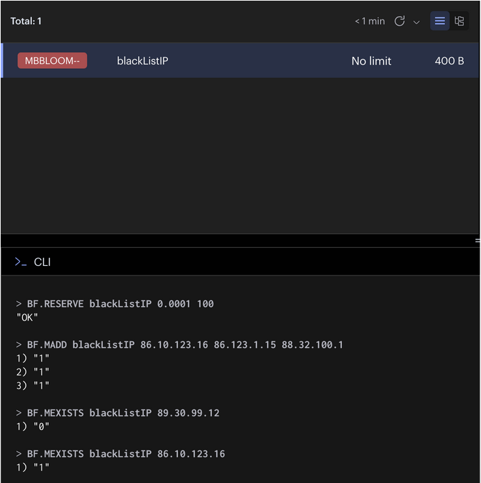
<h5><b>Figure 5: Vérification des adresses IP dans une liste noire avec Bloom Filters<b></h5>
</center>

<h3>5. Étude des performances de Redis:</h3>

<p>
Dans le cadre de cette étude, notre objectif est d'analyser la performance de Redis avec deux méthodes differentes, à savoir les filtrers de Bloom et les listes, dans le contexte de la gestion de grandes quantités de données. Dans cette étude on va utiliser le dictionnaire disponible sur le lien suivant: <a href="rali.iro.umontreal.ca/DEM//DEM-1_1.csv">Cliquez ici.</a></p>
<p>
La problématique est: Comment les filtres de Bloom et les listes se comportenet-ils lors du stockage et de la récuperation de 100 000 mots ? Pour répondre à cette question, nous mettrons en oeuvre un test afin de mesurer les temps d'insertion et d'appartenance des mots pour chaque structure de données.
</p>
<p>
Dans cette démarche comparative, nous cherchons à déterminer laquelle des méthodes offre la meilleure performance en termes de temps d'accès et de réponses.
</p>

***Première étape: Préparation du travail***

<p>Avant de commmencer on va convertir le fichier CSV vers un format JSON en mettant particulièrement l'accent sur deux clés essentielles: mot "M" et définition "SENS". Le choix du format JSON a été par sa capacité à représenter des informations complexes et à sa flexibilité.


```python
import pandas as pd
import json

# Charger le fichier CSV et Sélectionner juste les deux colonnes
df = pd.read_csv("csv/test.csv", delimiter = '\t', usecols=['M', 'SENS'])

# Convertir le DataFrame sélectionné en format JSON
json_data = df.to_json(orient='records', force_ascii=False)

# Écrire le fichier JSON
json_file_path = 'json/my_json.json'
with open(json_file_path, 'w') as json_file:
    json_file.write(json_data)

# Vérifier la transformation
with open('json/my_json.json', 'r', encoding='utf-8') as file:
    data = json.load(file)
#for item in data[:3]:
    #print(item.get('M'))
    #print(item.get('SENS'))
```

***Deuxième étape: Gestion des élements nuls***

<p>
Après avoir accompli la première étape (la conversion du fichier CSV vers un fichier JSON), une observation cruciale a été faite, c'est que le fichier contient des éléments nuls  qui peuveut entrainer des problèmes lors de l'insertion des données dans redis que ce soit la manière utiliser (Bloom filter ou liste). C'est pour ça on va implémenter une méthode qui permet de filter les éléments nuls.
</p>


```python
def to_list(iterable):
    return [element for element in iterable if element is not None]
```


```python
df = pd.read_json('json/my_json.json')
mots_definitions = to_list(df['M'].tolist())
definitions = to_list(df['SENS'].tolist())

#Jointure
mots_definitions.extend(definitions)
```

***Troisème étape: Étude de la performance avec Bloom filter:***


```python
import redis
import json
import time

client_redis = redis.Redis(host='localhost', port=6379)
```


```python
#Méthode d'insertion avec bloom filter
def insert_bloomfilter(list):    
    BLOOM_FILTER_KEY = "words:bloom_filter"
    client_redis.bf().reserve(BLOOM_FILTER_KEY, 0.01, len(list))
    start_time = time.time()
    client_redis.bf().madd(BLOOM_FILTER_KEY, *list)
    elapsed_time = time.time() - start_time
    return print(f"Temps d'insertion pour bloom filter est: {elapsed_time} secondes")

#Test
insert_bloomfilter(mots_definitions)
```

    Temps d'insertion pour bloom filter est: 1.1293649673461914 secondes


```python
#Méthode de recherche avec bloom filter
def search_bloomfilter(redis_client, list, bloomfilter_key):
    start_time = time.time()
    
    result = redis_client.bf().mexists(bloomfilter_key, *element)
    elapsed_time = time.time() - start_time
    print(f"Temps d'appartenance avec bloom filter est : {elapsed_time} secondes")

my_bloom_filter= "words:bloom_filter"
value_to_search = mots_definitions[len(mots_definitions)-1]

#Test
search_bloomfilter(client_redis, mots_definitions, list_key)
```

    Temps pour bloom filter : 0.003640890121459961 secondes


***Quatrième étape: Étude de la performance avec les listes:***


```python
#Méthode d'insertion avec les listes
def insert_list(list):    
    LIST_KEY = "words:list"
    start_time = time.time()
    client_redis.rpush(LIST_KEY, *list)
    elapsed_time = time.time() - start_time
    return print(f"Temps d'insertion pour une liste : {elapsed_time} secondes")
    
#Test
insert_list(mots_definitions)
```

    Temps d'insertion pour une liste : 0.8318448066711426 secondes


```python
#Méthode de recherche avec les listes
def search_list(redis_client, list, list_key):
    start_time = time.time()
    for element in list:
        position = redis_client.lpos(list_key, element)
    elapsed_time = time.time() - start_time
    print(f"Temps d'appartenance avec une liste est: {elapsed_time} secondes")
    average_time_per_membership = elapsed_time / len(list)
    print(f"Temps de chaque mot est: {average_time_per_membership} secondes")
    
list_key= "words:list"

#Test
search_list(client_redis, mots_definitions[:10000], list_key)
```

    Temps pour list : 11.410327196121216 secondes
    Temps/word pour list : 0.0011410327196121216 secondes


***Remarque***
<p>
Suite à l'insertion des données dans Redis, nous avons noté une observation importante concernant l'espace occupé par chacune. Cette observation est présentée dans <b>la figure 6</b>, le filtre de Bloom occupe un espace mémoire de 391 kilo-octets (KB). Cette mesure reflète la taille nécessaire pour stocker les éléments dans le filtre de Bloom. Parallèlement, la liste utilisée dans notre étude occupe 4 mégaoctets (MB) d'espace mémoire.
</p>
<p>
La différence significative entre l'espace mémoire occupé par le filtre de Bloom et celui occupé par la liste indique des caractéristiques distinctes en termes d'efficacité de stockage. Le filtre de Bloom semble être une option plus économique en termes d'espace mémoire, occupant sensiblement moins d'espace que la liste traditionnelle.
</p>
<center>
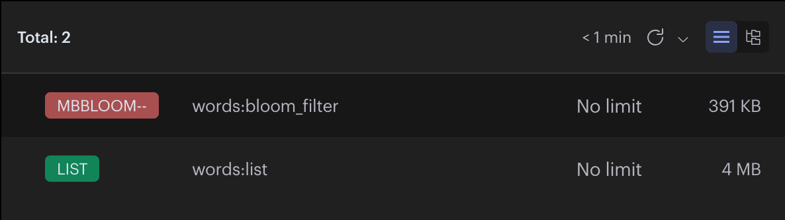
<h5><b>Figure 6: Comparaison de l'espace mémoire occupé<b></h5>
</center>

<h4>Conclusion:</h4>
<p>
Les résultats de nos fonctions de performance montrent clairement que l'utilisation de Bloom filter offre des performances supérieures pour l'opération de la recherche. L'insertion avec Bloom filter plus lente que celle avec la liste, mais la différene est minime. En revanche, la recherche avec Bloom filter est extremement rapide par rapport à la liste, ce qui montre l'efficacité de Bloom filter pour les opération d'appartenance.
</p>
<p>
Finalement, l'utilisation de Bloom filter se révèle avantageuse pour les opérations de recherche, offrant aussi une solution performante et économe de temps d'exécution.
</p>

<h3>5. Publication et souscription</h3>
<p>
    Le principe de publication et de souscription est un modèle de communication entre différents composants logiciels ou systèmes.
Il permet à des parties distinctes de s'échanger des informations de manière asynchrone, sans qu'elles soient directement couplées les unes aux autres. Dans ce contexte, la situation décrite est semblage à ce qui est représenté dans <b> la figure 7</b>. 
   
<center>
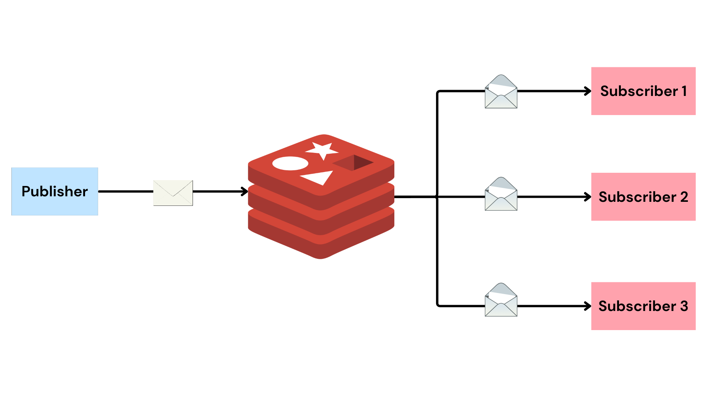
<h5><b>Figure 7: Publication et souscription<b></h5>
</center>
</p>
<h4>5.1. Scénario d'application: calcul de la moyenne de CO2:</h4>
<p>
L'objectif de cette application est de mettre en place le mécanisme de pub/sub en utilisant deux script. Le premier agit en tant que producteur qui publie de manière périodique des mesures de CO2 en utilisant le canal "co2_channel", qui sont générées aléatoirement, le script s'exécute d'une manière continue et aléatoire avec un intervalle entre 1 et 3 secondes.
</p>
<p>
Le deuxième script fonctionne comme un recepteur, qui recoit les données. À chaque minute il récupère les données du canal et calcule la moyenne des valeurs de CO2 reçues au cours de la dérnière minute, des dérnières 30 minutes et la dérnière heure. Le scipt utilise le canal "co2_channel" pour souscrir aux données publiées par le premier script.
</p>
<p>Si vous utilisez jupyter, vous n'avez pas la capacité à exécuter les deux scripts en parallèle. Pour résoudre ce problème, de vous invite à voir <b>l'Annexe 4</b>.</p>

***Première étape: Publication des Donnés:***


```python
import json
import redis
import random
from datetime import datetime
import time

r = redis.Redis(host='localhost', port=6379) 

def generate_random_co2_value():
    return round(random.uniform(300, 1000))

def send_co2():
    current_date = datetime.now().strftime('%Y-%m-%d %H:%M:%S')
    co2_value = generate_random_co2_value()
    
    # Créer un dictionnaire
    data = {'date': current_date, 'co2_value': co2_value}
    
    # Convertir le dictionnaire en format JSON
    json_data = json.dumps(data)
    
    r.publish('co2_channel', json_data)

while True:
    random_seconds = random.uniform(1, 3)
    send_co2()
    time.sleep(random_seconds)

```

***Deuxième étape étape: Souscription des Donnés:***


```python
import redis
import json 
import time
from datetime import datetime, timedelta
import schedule


r = redis.Redis(host='localhost', port=6379) 
pubsub = r.pubsub()
channel = 'co2_channel'
pubsub.subscribe(channel)
historique=[]

def get_data():
    message = pubsub.get_message()
    if(message and message.get('data') and message.get('data') != 1):
        data = json.loads(message.get('data'))
        msg = {"date": datetime.strptime(data['date'], '%Y-%m-%d %H:%M:%S'), "co2_value": data.get("co2_value")}
        historique.insert(0, msg)

def get_last_n_minutes(minutes, historique):
    now = datetime.now()
    time_threshold = now - timedelta(minutes=minutes)
    return [item for item in historique if item['date'] >= time_threshold]

def calculate_avg(historique):
    co2_values = [item['co2_value'] for item in historique]
    return sum(co2_values) / len(co2_values)

def calculate():
    if(len(historique) > 0):
        last_1_minutes = get_last_n_minutes(1, historique)
        avg_last_1_minutes = calculate_avg(last_1_minutes)

        last_30_minutes = get_last_n_minutes(30, historique)
        avg_last_30_minutes = calculate_avg(last_30_minutes)

        last_1_hour = get_last_n_minutes(60, historique)
        avg_last_1_hour = calculate_avg(last_1_hour)

        print("Dernière minute: " + str(round(avg_last_1_minutes, 1)))
        print("Dernières 30 minutes: " + str(round(avg_last_30_minutes, 1)))
        print("Dernière heure: " + str(round(avg_last_1_hour, 1)))
        print("--------------------------")
    

schedule.every(1).minutes.do(calculate)

while True:
    get_data()
    schedule.run_pending()
    time.sleep(1)
```

<h4>Conclusion:</h4>
<p>
En conclusion, les résultats obtenus démontrent l'efficacité du mécanisme pub/sub mis en place. Le script de souscription (subscribe) réussit à recevoir de manière fiable les mesures de CO2 publiées par le script de publication (publish) sur le canal "co2_channel". 
</p>
<p>
La flexibilité du canal "co2_channel" se révèle particulièrement avantageuse, car il peut être utilisé avec plusieurs instances des scripts de manière simultanée.

<h1>III. Découverte de la base de donnée MongoDB:</h1>
<p>
MongoDB est une base de données orientée documents. En clair, vous bénéficiez de la scalabilité et de la flexibilité que vous voulez, avec les fonctions d’interrogation et d’indexation qu’il vous faut.
Alors, êtes-vous prêt à plonger dans l'aventure MongoDB ? Dans un instant, nous allons mettre en pratique ces concepts et maîtriser l'art de la gestion de données avec agilité. Attachez vos ceintures, c'est parti ! 🚀
</p>

<h3>1. Installation:</h3>
<p>
La procédure détaillée est disponible dans <b>l'Annexe 3</b>. Pour une installation efficace de MongoDB, je vous recommande d'utiliser Docker Compose et MongoDB Compass pour la visualisation. Cette approche simplifiée vous permettra de déployer MongoDB dans des conteneurs Docker tout en facilitant la gestion avec Docker Compose.
</p>

<h3>2. Commandes fondamentales  de MongoDB:</h3>
<p>
<p>Avant de commencer, il est essentiel de connaitre le format de stockage de MongoDB. Les informations sont stockées dans des documents au format JSON (plus exactement BSON, une version binaire du JSON).
<p>
</p>
<H4> 2.1. Création de collection:</H4>
<p>   
MongoDB est structuré autour de 3 éléments : <b> le document</b>, <b>la collection</b> et<b> la database.</b>

    - Une database contient une ou plusieurs collections.
    - Une collection regroupe un ensemble de documents.
</p>


```python
pip install pymongo
```

    Requirement already satisfied: pymongo in /Library/Frameworks/Python.framework/Versions/3.12/lib/python3.12/site-packages (4.6.0)
    Requirement already satisfied: dnspython<3.0.0,>=1.16.0 in /Library/Frameworks/Python.framework/Versions/3.12/lib/python3.12/site-packages (from pymongo) (2.4.2)
    
    [notice] A new release of pip is available: 23.3.1 -> 23.3.2
    [notice] To update, run: pip install --upgrade pip
    Note: you may need to restart the kernel to use updated packages.


```python
import pymongo
from pymongo import MongoClient

clientDB = pymongo.MongoClient("<db_userName>:<db_password>@<db_url>/")
mydb = clientDB["BUT3"]
mycollection = mydb["Informatique"]  
```

<H4> 2.2. Méthodes d'insertion:</H4>

<H5> 2.2.1. Insertion d'un objet JSON:</H5>


```python
mycollection.insert_one({ "name": "ikram", "address": "paris" })

for y in mycollection.find():
  print(y) 
```

    {'_id': ObjectId('6585421f43341b608c85fccb'), 'name': 'ikram', 'address': 'paris'}
    {'_id': ObjectId('6585422643341b608c85fccc'), 'name': 'ikram', 'address': 'paris'}


<p>
    <b>La figure 8</b> montre une démonstration d'insertion d'un objet JSON dans MongoDB, "BUT3" représente le nom de la base de données, tandis que "INFORMATIQUE" est le nom de la collection au sein de cette base de données. L'opération d'insertion concerne un unique document, sous la forme d'un objet JSON, qui est ajouté à la collection spécifiée. Il est noté que cet objet est inséré avec un index par défaut, suggérant probablement l'utilisation d'un index automatique assigné par MongoDB lors de l'insertion si aucun index explicite n'est spécifié.
</p>

<center>
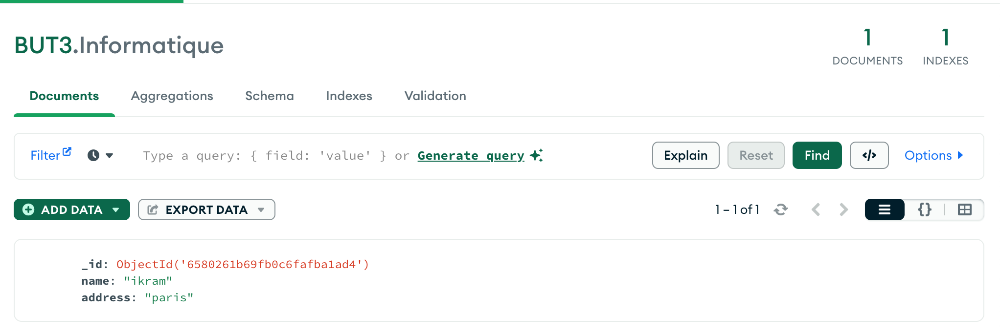
<h5><b>Figure 8: Démonstration d'insertion des donnée dans MongoDB<b></h5>  
</center>

<H5> 2.2.2. Insertion d'un tableau d'objet:</H5>


```python
import json

mydb = clientDB["Test_json"]
mycollection = mydb["json"]

with open("json/json1.json") as j1:
    json1 = json.load(j1)
    mycollection.insert_many(json1)  
    
res= mycollection.find()
for element in res:
    print(element)
```

    {'_id': ObjectId('658542a243341b608c85fcd5'), 'cle': '001', 'lieu': 'Mar 1'}
    {'_id': ObjectId('658542a243341b608c85fcd6'), 'cle': '001', 'lieu': 'Rane 1'}
    {'_id': ObjectId('658542a243341b608c85fcd7'), 'cle': '002', 'lieu': 'Mar 2'}
    {'_id': ObjectId('658542a243341b608c85fcd8'), 'cle': '002', 'lieu': 'Rane 2'}
    {'_id': ObjectId('658542a243341b608c85fcd9'), 'cle': '003', 'lieu': 'Mar 3'}
    {'_id': ObjectId('658542a243341b608c85fcda'), 'cle': '003', 'lieu': 'Rane 3'}
    {'_id': ObjectId('658542a243341b608c85fcdb'), 'cle': '003', 'lieu': 'Lila 1'}
    {'_id': ObjectId('658542a243341b608c85fcdc'), 'cle': '004', 'lieu': 'Mar 4'}


<p>
<b>La figure 8</b> représente le flux de travail de notre script d'insertion d'un tableau d'objets. Chaque objet JSON est stocké sous forme de document dans la collection MongoDB et chaque document possède un identifiant unique. Si aucun identifiant n'est spécifié pour un document, MongoDB attribue automatiquement un ID unique à ce document.

Cette approche assure une intégration efficace des données JSON dans MongoDB, offrant une flexibilité et une granularité dans la manipulation des documents au sein de la collection "Test_json". 
</p>

<center>
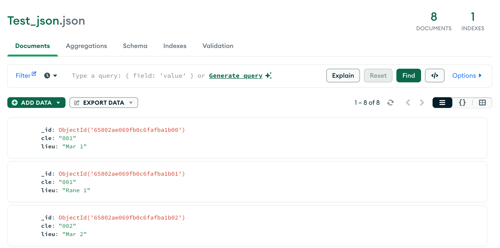
<h5><b>Figure 9: Démonstration de l'insertion de fichier JSON dans MongoDB<b></h5>  
</center>

<H4> 2.3. Récuperer le nombre de documents d'une collection:</H4>


```python
json_count = mycollection.count_documents({})
print(json_count)
```

    8


<H4> 2.4. Supprimer le contenu d'une collection:</H4>


```python
delete= mycollection.delete_many({})
```

<h3>3. La jointure des Objets JSON avec MongoDB:</h3>
<p>
MongoDB, offre une solution flexible pour effectuer des opération de jointure à l'aide de son pipeline d'agrégation, qui permet de fusionner des données provenant de différentes collections.
</p>
<p>
Tout d'abord, il faut utiliser <b>"lookup"</b> qui permet de spécifier la collection externe à joindre et les champs et les champs qui serviront de clés de jointure. <b>"project"</b> pour sélectionner les champs à inclure dans le résultat final. 
</p>


```python
from pymongo import MongoClient
import json
import pymongo

clientDB = pymongo.MongoClient("mongodb://<db_userName>:<db_password>@<db_url>/")
mydb = clientDB["test_jointure"]
collection_json1 = mydb["json1"]  
collection_json2 = mydb["json2"] 

with open("json/json1.json") as j1:
    json1 = json.load(j1)
    collection_json1.insert_many(json1)  
with open("json/json2.json") as j2:
    json2 = json.load(j2)
    collection_json2.insert_many(json2)  
```


```python
resultat = collection_json1.aggregate([
    {
        "$lookup": {
            "from": "json2",
            "localField": "cle",
            "foreignField": "cle",
            "as": "json2"
        }
    },
    {
        "$unwind": "$json2"
    },
    {
        "$project": {
            "cle": 1,
            "lieu": 1,
            "info": "$json2.info"
        }
    }
])
collection_json3 = mydb["json_resultat"] 
collection_json3.insert_many(resultat)

res= collection_json3.find()
for element in res:
    print(element)
```

    {'_id': ObjectId('658542f143341b608c85fcf8'), 'cle': '001', 'lieu': 'Mar 1', 'info': "L'info 1"}
    {'_id': ObjectId('658542f143341b608c85fcf9'), 'cle': '001', 'lieu': 'Rane 1', 'info': "L'info 1"}
    {'_id': ObjectId('658542f143341b608c85fcfa'), 'cle': '002', 'lieu': 'Mar 2', 'info': "L'info 2"}
    {'_id': ObjectId('658542f143341b608c85fcfb'), 'cle': '002', 'lieu': 'Rane 2', 'info': "L'info 2"}
    {'_id': ObjectId('658542f143341b608c85fcfc'), 'cle': '003', 'lieu': 'Mar 3', 'info': "L'info 3"}
    {'_id': ObjectId('658542f143341b608c85fcfd'), 'cle': '003', 'lieu': 'Rane 3', 'info': "L'info 3"}
    {'_id': ObjectId('658542f143341b608c85fcfe'), 'cle': '003', 'lieu': 'Lila 1', 'info': "L'info 3"}
    {'_id': ObjectId('658542f143341b608c85fcff'), 'cle': '004', 'lieu': 'Mar 4', 'info': "L'info 4"}


<h3>4. Étude des performances de MongoDB:</h3>

<p>Notre objectif est d'analyser l'impact des index sur la performance pour la récupération de grandes quantités de données. Nous comparerons les performances de MongoDB avec index et sans index en utilisant le même dictionnaire que celui employé précédemment avec Redis: <a href="rali.iro.umontreal.ca/DEM//DEM-1_1.csv">Cliquez ici.</a>.
</p>
<p>
La problématique centrale de notre étude est la suivante : Comment les index influencent-ils la performance pour la récupération de 100 000 mots dans le contexte de MongoDB ? Afin de répondre à cette question, nous allons mettre en œuvre un test approfondi visant à mesurer les temps d'appartenance des mots pour chaque configuration, avec et sans index.
</p>
<p>
Dans cette démarche comparative, notre objectif est de déterminer laquelle des méthodes offre la meilleure performance en termes de temps d'accès et de réponses.
</p>
<p>
En utilisant le même jeu de données que celui utilisé dans l'étude précédente avec Redis, nous pourrons comparer directement les résultats obtenus entre les deux bases de données. Cette analyse comparative nous permettra de prendre des décisions éclairées quant à l'utilisation ou non d'index dans des scénarios similaires avec MongoDB, contribuant ainsi à optimiser la gestion de grandes quantités de données.</p>
</p>


***Première étape: Étude de la performance sans index :***


```python
import json 
from pymongo import MongoClient

clientDB = MongoClient("mongodb://<db_userName>:<db_password>@<db_url>/")
mydb_one = clientDB["dictionnaire"]
mycollection_one = mydb_one["collection_without_index"] 

with open("json/my_json.json") as file:
        data = json.load(file)
    
res=mycollection_one.insert_many(data)

def search_by_name_without_index(word):
    temps_debut=time.time()
    element= mycollection_one.find({"M": word},{"M":1})
    for elm in element:
        print(elm)
    temps_fin=time.time()
    print("temps de recherche est: "+str(temps_fin-temps_debut)+" secondes")

search_by_name_without_index("à la rencontre de")

```

    {'_id': ObjectId('6585431143341b608c85ff0d'), 'M': 'à la rencontre de'}
    temps de recherche est: 0.10278797149658203 secondes


***Deuxième étape: Étude de la performance avec index :***


```python
clientDB = MongoClient("mongodb://<db_userName>:<db_password>@<db_url>/")
mydb_two = clientDB["dictionnaire"]
mycollection_two = mydb_two["collection_with_index"] 

with open("json/my_json.json") as file:
        data1 = json.load(file)
    
res1=mycollection_two.insert_many(data1)

#Création d'index
index = [("M",1)]
mycollection_two.create_index(index)

def search_by_name_with_index(word):
    temps_debut=time.time()
    element= mycollection_two.find({"M": word},{"M":1})
    for elm in element:
        print(elm)
    temps_fin=time.time()
    print("temps de recherche est: "+str(temps_fin-temps_debut)+" secondes")

search_by_name_with_index("à la rencontre de")

```

    {'_id': ObjectId('6585431643341b608c88363b'), 'M': 'à la rencontre de'}
    {'_id': ObjectId('6585432543341b608c8a6d69'), 'M': 'à la rencontre de'}
    temps de recherche est: 0.001825094223022461 secondes


<h4>Résultat:</h4>
<p>
Les résultats obtenus mettent en évidence une distinction notable dans les performances entre l'utilisation d'index et l'absence d'index. Lorsque les index sont utilisés, le temps nécessaire pour vérifier l'appartenance d'une donnée est extremement court. En revanche, sans l'utilisation d'index, le temps augmente considérablement.
</p>
<p>
Notre étude démontre clairement l'impact positif des index sur la performance des opérations d'appartenance de données dans MongoDB. Les résultats montrent une réduction significative du temps d'accès, passant de ≈ 0.080 secondes sans index à seulement ≈ 0.002 secondes avec index. Ces conclusions soulignent l'importance stratégique de l'utilisation d'index pour optimiser les temps de recherche, offrant ainsi des pistes concrètes pour améliorer l'efficacité opérationnelle de notre système de gestion de données.
</p>

<p>
Pour obtenir une vision plus clair des performances entre une recherche avec et sans index, nous nous appuierons sur l'outil MongoDB Compass. Dans <b>la Figure 10</b>, nous observons une recherche sans index, indiquant que le moteur de recherche de MongoDB a parcouru la totalité des 145 197 documents pour trouver le résultat requis, avec un temps d'exécution de 118 ms. En contraste, <b>la Figure 11</b>, illustrant la recherche avec index, révèle une amélioration significative. Grâce à l'utilisation de l'index 'M', le moteur de recherche de MongoDB a consulté uniquement les documents pertinents, permettant ainsi une recherche d'une rapidité remarquable de 0 ms.
</p>

<center>
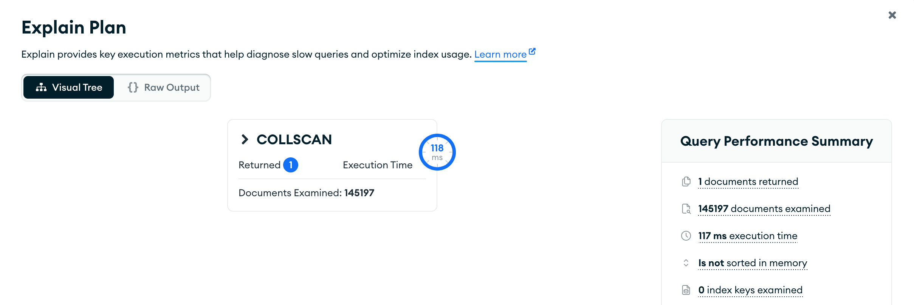
<h5><b>Figure 10: Détails de la recherche sans index <b></h5>  
</center>
    <br>
    <br>
<center>
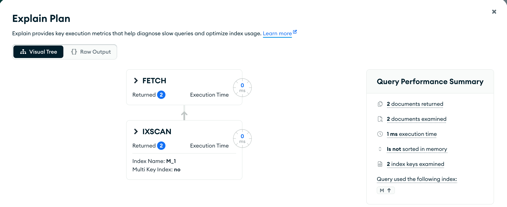
<h5><b>Figure 11: Détails de la recherche avec index  <b></h5>  
</center>

<h4> Conclusion:</h4>
<div style="text-align: justify">
<p>
Pour conclure, notre présente étude sur MongoDB, en complément de l'étude précédente sur Redis, s'est concentrée sur la comparaison du temps d'appartenance entre les technologies Redis avec Bloom Filter, MongoDB sans Index, et MongoDB avec Index.
</p>
<p>
Les résultats indiquent que Redis avec Bloom filter excelle dans la rapidité des opérations d'appartenance. Cependant, la gestion prudente de la consommation de mémoire est nécessaire.
</p>
<p>
D'un autre côté, MongoDB avec index a démontré une amélioration notable des performances, particulièrement bénéfique pour des requêtes complexes, bien que cette optimisation s'accompagne d'une augmentation de l'utilisation de l'espace disque.
</p>
<p>
MongoDB sans index, présente des limitations évidentes lorsque la taille de la base de données augmente, comme notre ça d’étude, mais cette méthode viable pour des bases de données plus petites ou des opérations simples.
</p>
<p>
Finalement, le choix entre ces solutions dépendra des besoins spécifiques de l'application, mettant en balance la rapidité, la consommation de mémoire et l'utilisation de l'espace disque.
</p>
</div>
<center>

</center>

<h3>5. Publication et souscription:</h3>
<p>
Contrairement à Redis, MongoDB ne prend pas en charge nativement le modèle pub/sub. Mais malgé cette absence, il existe des solutions à developper par nous les développeurs pour attreindre des fonctionnalités similaires.
</p>
<b>Solution mise en oeuvre avec MongoDB:</b>
<p>
Change Streams: C'est une fonctionnalité MongoDB qui permet de suivre les changements au niveau de la base de données en temps réel, alors, ils sont utilisés pour détecter les changements dans une collection et déclencher des actions en conséquences. Cependant, pour activer les Change Streams, il est impératif d'activer le système réplicaset de MongoDB. Je vous invite à consulter<a href="https://www.mongodb.com/docs/manual/changeStreams/"> le lien suivant </a>pour plus des informations.
</p>


<p>Si vous utilisez jupyter, vous n'avez pas la capacité à exécuter les deux scripts en parallèle. Pour résoudre ce problème, de vous invite à voir <b>l'Annexe 4</b>.</p>


```python
#Test publisher:
```

<b>publisher_mongodb.py<b/>


```python
from pymongo.mongo_client import MongoClient
from pymongo.server_api import ServerApi
from datetime import datetime

import random
import time
import certifi

# Create a new client and connect to the server
def connectToMongodb():
    uri="mongodb+srv://<db_name>:<db_password>@<db_url>/"
    client = MongoClient(uri, server_api=ServerApi('1'), tlsCAFile=certifi.where())
    try:
        client.admin.command('ping')
        print("Pinged your deployment. You successfully connected to MongoDB!")
    except Exception as e:
        print(e)
    return client

# Connexion à la base de données
client = connectToMongodb()
collection = client["mydatabase"]['co2_channel']

def generate_random_co2_value():
    return round(random.uniform(300, 1000))

def send_co2():
    current_date = datetime.now().strftime('%Y-%m-%d %H:%M:%S')
    co2_value = generate_random_co2_value()
    
    # Créer un dictionnaire
    data = {'date': current_date, 'co2_value': co2_value}

    #Insertion dans le dictionnaire  
    collection.insert_one(data)

while True:
    random_seconds = random.uniform(1, 3)
    send_co2()
    time.sleep(random_seconds)

```


```python
#Test subscriber:
```

<b>subscriber_monodb.py</b>


```python
from datetime import datetime, timedelta
from pymongo.mongo_client import MongoClient
from pymongo.server_api import ServerApi
from datetime import datetime

import schedule
import certifi

def connectToMongodb():
    uri="mongodb+srv://<db_name>:<db_password>@<db_url>/"
    client = MongoClient(uri, server_api=ServerApi('1'), tlsCAFile=certifi.where())
    try:
        client.admin.command('ping')
        print("Pinged your deployment. You successfully connected to MongoDB!")
    except Exception as e:
        print(e)
    return client

# Connexion à la base de données
client = connectToMongodb()
collection = client["mydatabase"]['co2_channel']

# Tableau qui va stocker les données reçu du publisher
historique=[]

# Recupération des données de MongoDB (document_id: id du document inseré)
def get_data(document_id):
    message = collection.find_one({"_id": document_id})
    if(message):
        data = message
        msg = {"date": datetime.strptime(data['date'], '%Y-%m-%d %H:%M:%S'), "co2_value": data.get("co2_value")}
        historique.insert(0, msg)

def get_last_n_minutes(minutes, historique):
    now = datetime.now()
    time_threshold = now - timedelta(minutes=minutes)
    return [item for item in historique if item['date'] >= time_threshold]

def calculate_avg(historique):
    co2_values = [item['co2_value'] for item in historique]
    return sum(co2_values) / len(co2_values)

def calculate():
    if(len(historique) > 0):
        last_1_minutes = get_last_n_minutes(1, historique)
        avg_last_1_minutes = calculate_avg(last_1_minutes)

        last_30_minutes = get_last_n_minutes(30, historique)
        avg_last_30_minutes = calculate_avg(last_30_minutes)

        last_1_hour = get_last_n_minutes(60, historique)
        avg_last_1_hour = calculate_avg(last_1_hour)

        print("Dernière minute: " + str(round(avg_last_1_minutes, 1)))
        print("Dernières 30 minutes: " + str(round(avg_last_30_minutes, 1)))
        print("Dernière heure: " + str(round(avg_last_1_hour, 1)))
        print("--------------------------")

schedule.every(1).second.do(calculate)

# Créer un Change Stream sur la collection qui ecoute que les opération de type insert
change_stream = collection.watch([{"$match": {"operationType": "insert"}}])

# Gérer les événements de changement
for change in change_stream:
    document_id = change["documentKey"]["_id"]
    get_data(document_id)
    #Pour lancer le schedule
    schedule.run_pending()

```

<h4>Conclusion:</h4>
<p>
En conclusion, l'exploration des bases de données NoSQL, en particulier MongoDB et Redis, a révélé des caractéristiques distinctes et des performances spécifiques. MongoDB, en tant que système de gestion de base de données orienté document, a montré une efficacité notable pour les opérations de lecture et d'écriture complexes, avec une flexibilité accrue dans la modélisation des données. D'autre part, Redis, en mettant en œuvre des structures de données en mémoire, a démontré des performances exceptionnelles pour les opérations de lecture rapide, en tirant parti de structures telles que les bloom filters pour améliorer l'efficacité des opérations d'appartenance.
</p>
</p>
<p>
L'analyse comparative des performances avec et sans index dans MongoDB a révélé l'impact crucial des indices sur l'efficacité des requêtes. Cette constatation souligne l'importance de la conception réfléchie de l'indexation pour optimiser les performances des requêtes dans un environnement MongoDB.
</p>
<p>
Par ailleurs, l'étude de la fonctionnalité pub/sub dans Redis a mis en évidence la capacité de ce système à fournir une communication asynchrone efficace entre les différentes parties de l'application, offrant ainsi une flexibilité précieuse dans le traitement des données.
</p>
<p>
En somme, l'utilisation judicieuse de ces bases de données NoSQL en fonction des exigences spécifiques de chaque application est cruciale. MongoDB et Redis offrent des avantages distincts, et le choix entre eux dépendra des besoins précis en termes de performances, de structure des données et de fonctionnalités requises. Cette étude approfondie fournit des insights précieux pour vous guidez dans la prise de décision concernant le choix de la base de données NoSQL la mieux adaptée à vos projets.
</p>

<h2>Table des Annexes:</h2>
<h4>Annexes 1: Installation de Redis</h4>

- Créez un fichier `Dockerfile` avec la configuration.<br>

<center>
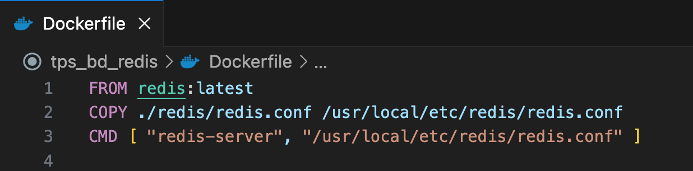
<h5><b>Annexes 1: Déploiement de Redis avec Dokerfile<b></h5>  
</center>
    
<h4>Annexes 2:  Installation de Redis (suite)</h4>

- Créez un fichier `DockerCompose.yml` avec la configuration.<br>
<p>
   
</p>
<center>
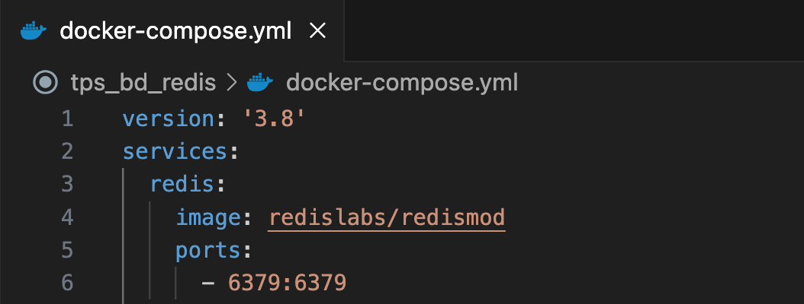
<h5><b>Annexes 2: Orchestration de déploiement de Redis<b></h5>
</center>
    
<h4>Annexes 3: Installation de MongoDB</h4>
<p>
    
1. Installation de MongoDB avec Docker Compose :
    - Créez un fichier `docker-compose.yml`avec la configuration.<br>
    - Exécutez la commande `docker-compose up -d` pour démarrer MongoDB avec Docker Compose.<br>
    
<center>
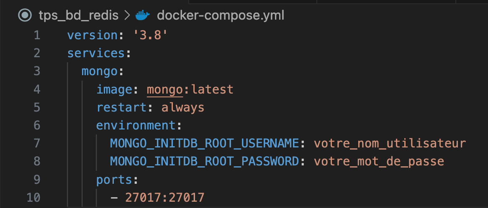
<h5><b>Annexes 3: Installation de MongoDB<b></h5>
</center>
    
2. Utilisation de MongoDB Compass pour la visualisation :
   - Installez MongoDB Compass depuis le site officiel <a href="https://www.mongodb.com/products/tools/compass">Cliquez ICI.</a> 
   - Lancez MongoDB Compass et connectez-vous à votre instance MongoDB avec l'adresse `localhost:27017` et les identifiants du fichier `docker-compose.yml`.

</p>


<h4>Annexes 4: Éxecution des scripts Pub/Sub </h4>
<p>
    
1. Positionnement dans le réperoire:
- Ouvrez un terminal ou une console dans le répertoire où se trouvent les scripts<br>
- Exécutez la commande `$cd Path/repertoire` .<br>
    
2. Lancement du Script Subscriber :
- Exécutez la commande `$python3 publisher_mongodb.py` .<br> 
  
3. Lancement du Script Publisher :
- Dans un autre terminal, exécutez la commande `$python3 subscriber_monodb.py` .<br> 
</p>
